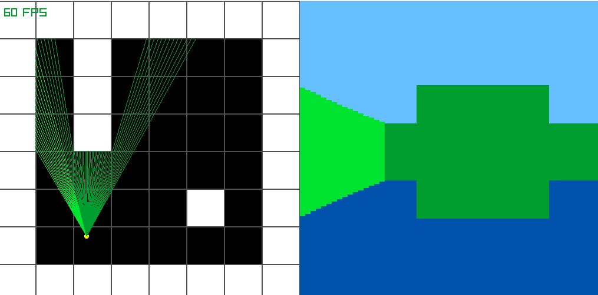

# Raycaster Demo

## About

This is a raycaster demo that I made with the C graphics library raylib. I am working on a framework to create games in raylib using raycasting.

## Demo
[ Watch Demo](https://youtu.be/az3yp684duk)